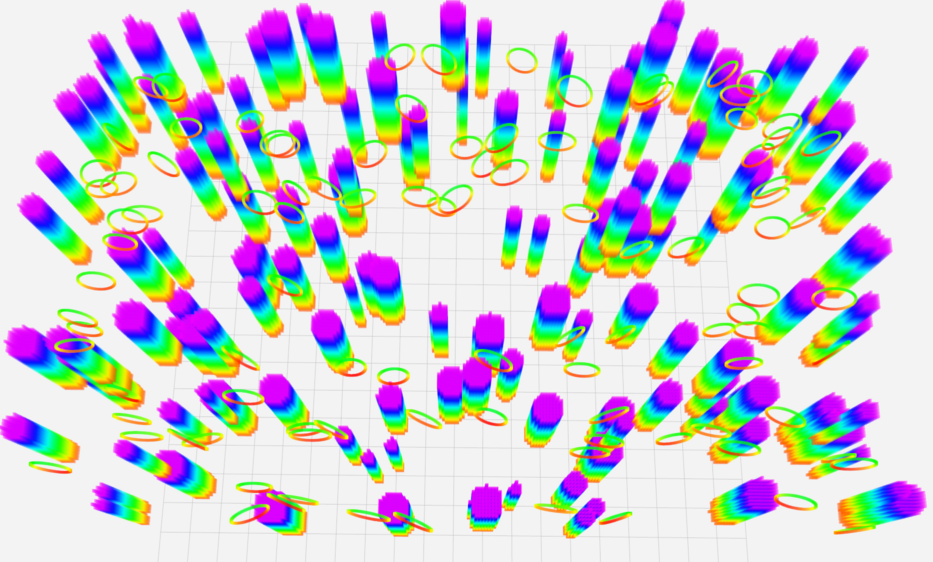

# map_generator
Independent ros package to generate random map. The code is revised from [fast planner](https://github.com/HKUST-Aerial-Robotics/Fast-Planner)

### usage

1. generate a point cloud global map of boxes and circles. 

2. generate semantic map.

you can also directly use the semantic information and create your own semantic map for planning. The example generates the semantic map of cylinders and publish both the cylinders informaton and point cloud.

