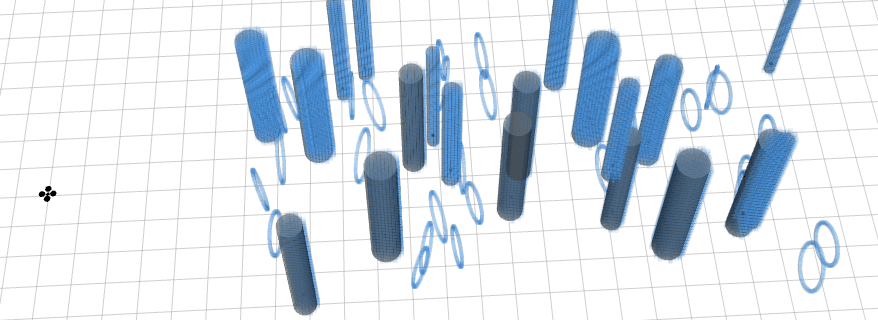

# map_generator
Independent ros package to generate random map. The code is revised from 
[map_generator](https://github.com/yuwei-wu/map_generator). It works with simulator in [fast planner](https://github.com/HKUST-Aerial-Robotics/Fast-Planner) andn [ego planner](https://github.com/ZJU-FAST-Lab/ego-planner-swarm).


### Usage

```
roslaunch map_generator dyn_map.launch
```

or include this file into your planner launch file.

### Demo

1. generate a point cloud global map of boxes and circles. 


1. generate semantic map.

you can also directly use the semantic information and create your own semantic map for planning. The example generates the semantic map of cylinders and publish both the cylinders informaton and point cloud.


3. generate dynamic map




